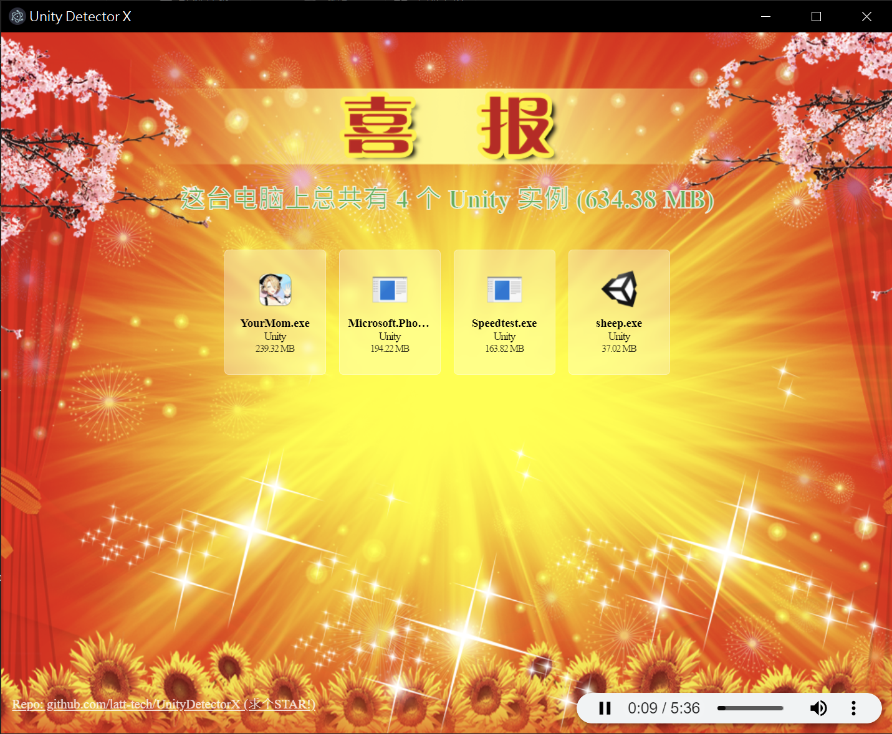

# Unity Detector X - 一眼Unity X: 年轻人的 Windows Unity检测器 

Check how many Unitys are on your Windows.

**【使用 Electron 编写并提供更多功能】**

看看你电脑 **(Windows)** 上有多少个 [Unity](https://unity.com).

> **Note**
> 欢迎你把程序截图发到 [Discussions](https://github.com/latt-tech/Unity/discussions/17) 中, 看看谁才是真的 **《超级Unity王》**

## 截屏

## 使用

**你首先需要安装 [Everything](https://www.voidtools.com/) 并完成全硬盘的扫描.**

从 [Release](https://github.com/latt-tech/UnityDetectorX/releases) 页面下载最新的压缩包, 解压后运行 `UnityDetectorX.exe` 即可.

> **Warning**
> 不支持精简版Everything, 它不允许 [IPC](https://www.voidtools.com/zh-cn/support/everything/sdk/ipc/)

## 特性

- 检测 Unity 的软件: 如 [UnityPlayer.dll]
- 显示总空间占用
- 显示当前所运行的进程 (绿色文件名)
- 单独显示每个程序的空间占用并按大小排序
- 支持自定义背景音乐 (默认为: [The Magnificent Seven](https://soundcloud.com/7kruzes/the-magnificent-seven), 替换 resources/app/bgm.mp3 即可)
- 可以通过添加参数 `--no-bgm` 的形式来关闭背景音乐

## 作者

Whirity404

创意来自 @Lakr233 的 [SafariYYDS](https://github.com/Lakr233/SafariYYDS) 项目.

由 @Shirasawa 的 [CEFDetectorX](https://github.com/Shirasawa/CEFDetectorX) 项目 改造而来。

## 鸣谢

Shirasawa

## 协议

[MIT](./LICENSE)
